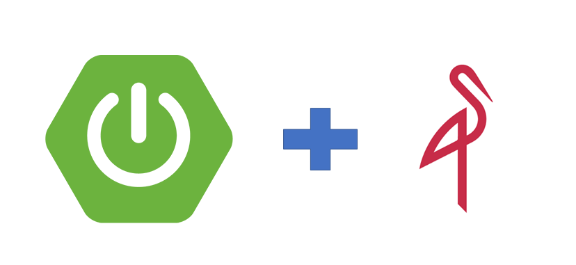

# Spring Boot Minio




### 🔨 Run the App

<b>1 )</b> Install <b>Docker Desktop</b>. Here is the installation <b>link</b> : https://docs.docker.com/docker-for-windows/install/

<b>2 )</b> Open <b>Terminal</b> under <b>resources</b> folder to run <b>Minio</b> on <b>Docker</b> Container

```bash
    docker-compose up -d
```
<b>3 )</b> Open <b>Minio</b> in the Browser 
```
    127.0.0.1:9001
```
<b>4 )</b> Enter username and password 
```
    username : minioadmin
    password : minioadmin
```

## Swagger
> **Access : http://localhost:8080/swagger-ui.html**